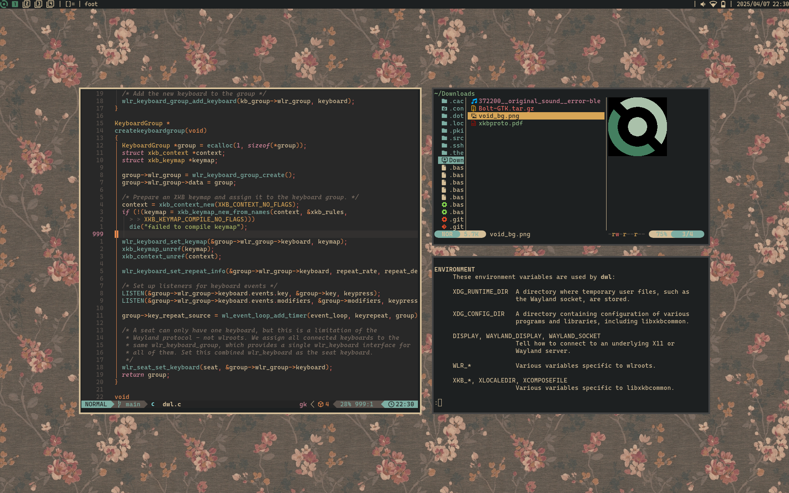

# dotfiles

- compositor: [dwl](https://github.com/tgsl8r/dwl)
- bar: [yambar](https://codeberg.org/dnkl/yambar)
- terminal: [foot](https://codeberg.org/dnkl/foot)
- menu: [fuzzel](https://codeberg.org/dnkl/fuzzel)
- editor: [neovim](https://github.com/tgsl8r/nvim)
- browser: [qutebrowser](https://qutebrowser.org/)
